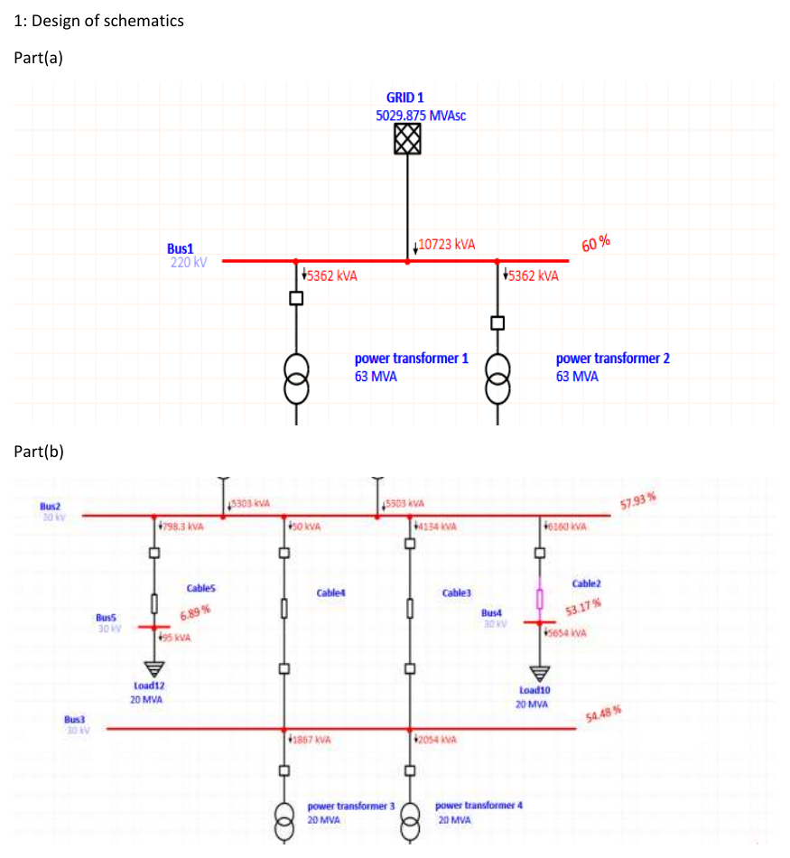
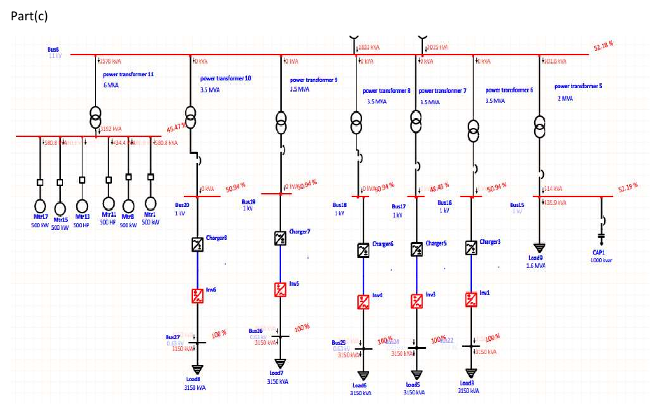
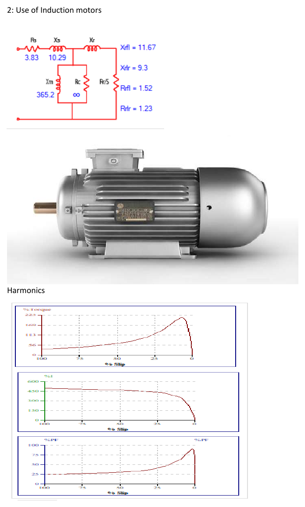
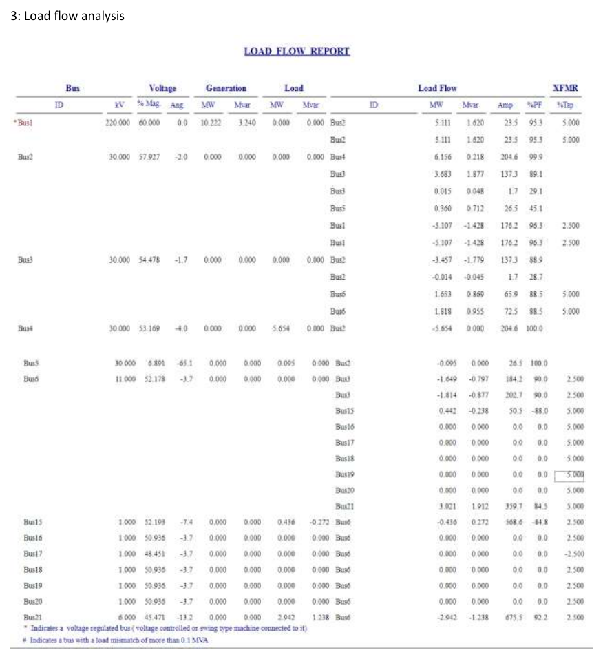
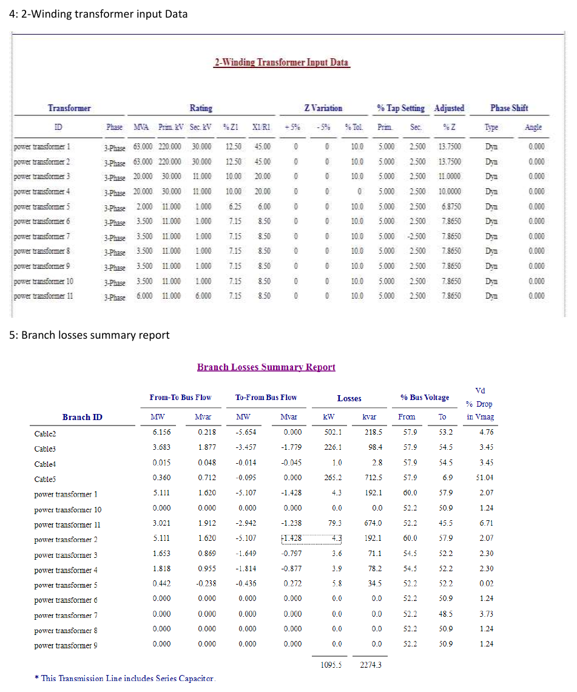
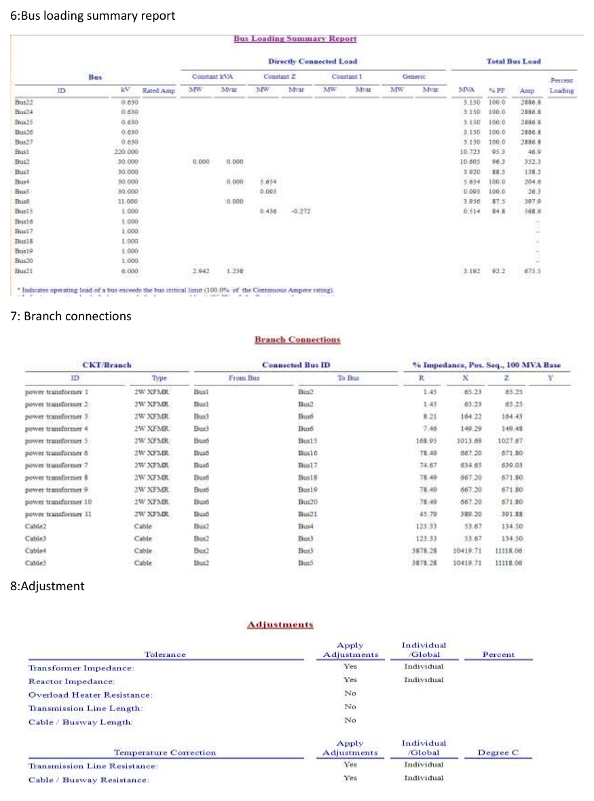
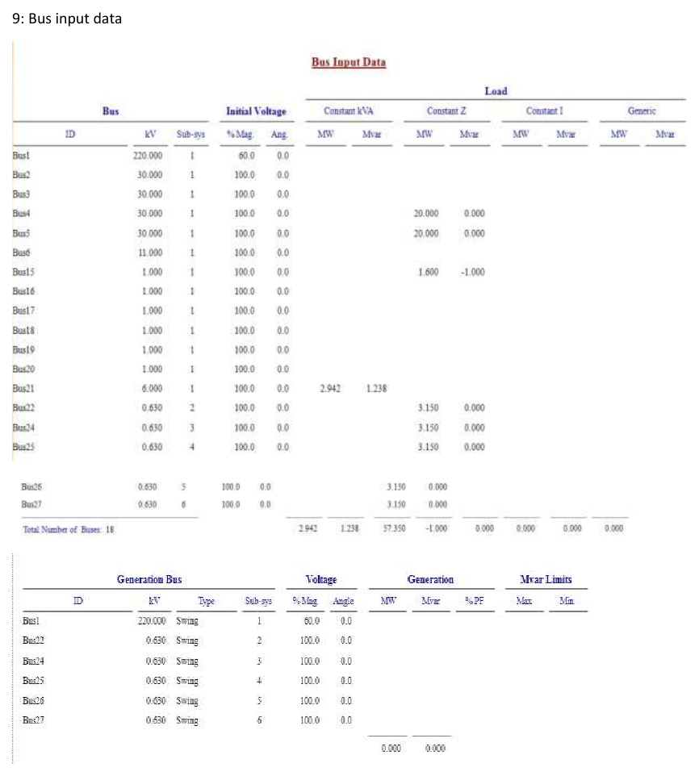
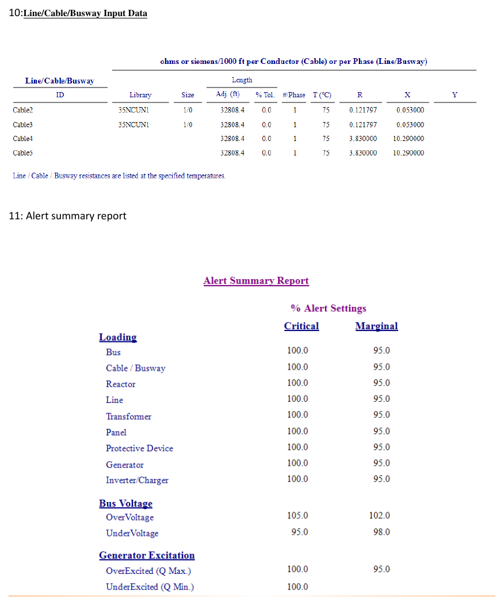
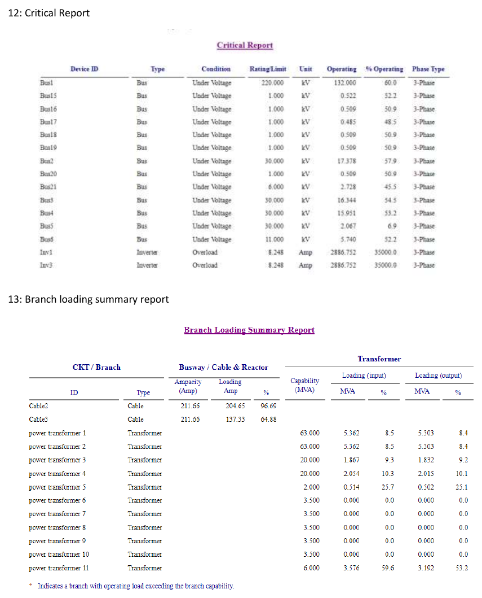

# Analysis and Design of a Grid-Connected Real Plant Using ETAP

**Software / Language:** ETAP 19.0.1C (no programming language used)
**Study case:** Load Flow (LF)
**Type:** Academic group project, B.E. Electrical Engineering (Power), Air University, Islamabad

## Overview

A grid-connected plant modelled in ETAP: a 220 kV grid source feeds a 30 kV network through two 63 MVA transformers, which is stepped down to 11 kV, 6 kV, 1 kV and 0.63 kV levels for motors, capacitor bank, charger/inverter loads and general loads. The report contains the single-line diagrams, equipment input data and the load flow, loading, loss and alert reports.

## System summary

| Item | Data |
|---|---|
| Grid source | 220 kV, 5029.875 MVAsc |
| Transformers 1 and 2 | 63 MVA, 220/30 kV |
| Transformers 3 and 4 | 20 MVA, 30/11 kV |
| Transformers 6 to 10 | 3.5 MVA, 11/1 kV |
| Transformer 5 | 2 MVA, 11/1 kV (feeds 1.6 MVA load and 1000 kvar capacitor bank) |
| Transformer 11 | 6 MVA, 11/6 kV (feeds six 500 kW/HP induction motors) |
| Charger/inverter branches | Five branches, 0.63 kV, 3150 kVA load each |
| Cables | Cable2 to Cable5 (32808.4 ft each) |
| Total generation (swing bus) | 10.222 MW, 3.240 Mvar |
| Total branch losses | 1095.5 kW, 2274.3 kvar |

## Report content

### 1. Design of schematics (single-line diagrams)
Part (a): 220 kV grid and the two 63 MVA power transformers. Part (b): 30 kV network with cables and the 20 MVA transformers.

Part (c): 11 kV bus, 11/1 kV transformers, chargers and inverters, capacitor bank and the motor feeder.

### 2. Use of induction motors
Induction motor equivalent circuit parameters and the torque, current and power factor curves against slip.

### 3. Load flow analysis
Bus voltages, generation, loads and branch power flows from the ETAP load flow report.

### 4. Two-winding transformer input data and 5. Branch losses summary

### 6. Bus loading summary, 7. Branch connections, 8. Adjustments

### 9. Bus input data

### 10. Line/cable/busway input data and 11. Alert summary

### 12. Critical report and 13. Branch loading summary

## Full report
The complete report is available as a PDF: [ETAP_Grid_Connected_Plant_Analysis.pdf](ETAP_Grid_Connected_Plant_Analysis.pdf)

## My role
Modelled the complete grid-connected plant in ETAP — built the single-line diagrams across all three voltage sections (220 kV/30 kV/11 kV), configured transformer, cable, motor, and load parameters, ran the load flow study, and compiled the equipment input data, loading, loss, and alert reports into the final analysis.

## Team
Muhammad Shahzaib, Muhammad Ali, Muhammad Hamza Nasir (Islamabad Electric Supply Company)

## Tools
ETAP 19.0.1C
